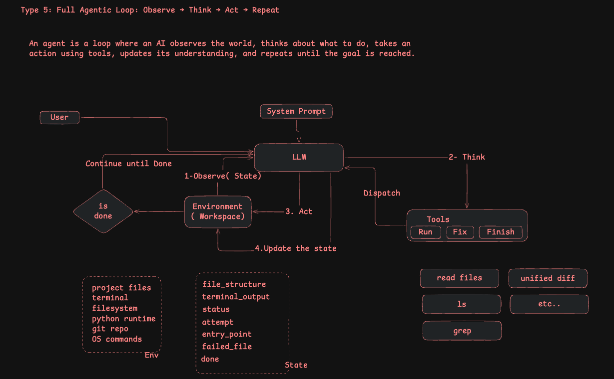
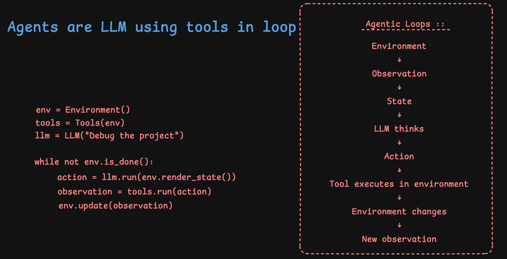

# Build Your Own Agent — Step by Step

A hands-on course that builds a **Python debugging AI agent from scratch**.  
Each step is self-contained, runnable, and adds exactly one new concept.





```
Step 1 ──▶ Step 2 ──▶ Step 3 ──▶ Step 4 ──▶ Step 5
 API call   Chat +     Tools      State +     Full
 skeleton   history    layer      1 cycle     agentic
                                             loop ✅
```

---

## The Journey at a Glance

| Step | Folder | What you build | New concept |
|------|--------|----------------|-------------|
| 1 | `step1-hello-llm/` | One question → one answer | OpenAI API basics |
| 2 | `step2-chat-memory/` | Multi-turn chatbot | System prompt + message history |
| 3 | `step3-tool-use/` | LLM picks and runs a tool | JSON actions + tool dispatch |
| 4 | `step4-observe-act/` | One full Observe→Think→Act cycle | `Environment` state object |
| 5 | `step5-agent-loop/` | Autonomous loop until success | `while` loop + `max_steps` guard |

---

## Setup (do this once)

### 1. Create a virtual environment
```bash
python -m venv .venv
source .venv/bin/activate
```

### 2. Install dependencies
```bash
pip install -r requirements.txt
```

### 3. Add your OpenAI API key
```bash
cp .env.example .env
# then edit .env and paste your key
```

---

## How to Run Each Step

Every step is a standalone folder. `cd` into it and run `agent.py`:

```bash
cd step1-hello-llm  && python agent.py
cd step2-chat-memory && python agent.py
cd step3-tool-use    && python agent.py
cd step4-observe-act && python agent.py
cd step5-agent-loop  && python agent.py
```

Each folder has its own `README.md` explaining what changed and why.

---

## Step-by-Step Breakdown

### Step 1 — `step1-hello-llm`: Bare API Call
**Files:** `agent.py`

The absolute minimum. Send one question to the OpenAI API, print the answer.  
No loop, no memory, no tools.

```
[You] ──question──▶ [LLM] ──answer──▶ [print]
```

---

### Step 2 — `step2-chat-memory`: System Prompt + History
**Files:** `agent.py`  
**Run:** `python agent.py` (interactive — type to chat)

Adds a `ChatBot` class that keeps a growing `messages` list.  
The full history is sent to the LLM on every call so it remembers past turns.

```
[You] ──user msg──▶ [ChatBot] ──messages list──▶ [LLM] ──reply──▶ [print]
                        ▲                                              │
                        └──────────── appended to history ────────────┘
```

---

### Step 3 — `step3-tool-use`: The LLM Can DO Things
**Files:** `agent.py`, `main.py` (broken)

The LLM no longer returns plain text — it returns a **JSON action**:
```json
{"tool": "run", "file": "main.py"}
{"tool": "fix", "file": "main.py"}
```
A `Tools` class dispatches the JSON to real Python functions.

```
[LLM] ──JSON action──▶ [Tools.dispatch()] ──▶ run_program() / fix_file()
```

---

### Step 4 — `step4-observe-act`: Environment + State
**Files:** `agent.py`, `main.py` (broken)

Adds an `Environment` class — a shared notebook that all components read/write.  
The LLM now receives a **structured JSON snapshot** of the state, not a plain sentence.  
One complete Observe → Think → Act → Observe cycle runs explicitly.

```
env.snapshot() ──▶ LLM ──▶ action ──▶ Tools ──▶ observation ──▶ env.update()
```

---

### Step 5 — `step5-agent-loop`: Full Agentic Loop ✅
**Files:** `agent.py`, `main.py`, `helper.py` (broken)

Replaces the hardcoded 2-step script with a `while not env.is_done()` loop.  
Adds `max_steps` as a safety net. The LLM can now call `{"tool": "finish"}` when satisfied.  
Uses a two-file project to show multi-file debugging across multiple loop iterations.

```
┌─────────────────────────────────────────────────┐
│           while not env.is_done()               │
│  OBSERVE ──▶ THINK ──▶ ACT ──▶ UPDATE ──┐       │
│                                         └──▶ 🔁 │
└─────────────────────────────────────────────────┘
```

---

## Key Concepts Map

```
                    ┌──────────────────────────────────┐
                    │         Agentic Loop              │
                    │                                  │
  ┌──────────┐      │  ┌───────────┐   JSON action     │
  │  .env    │      │  │    LLM    │ ─────────────────▶│
  │ API key  │──────▶  │ (decides) │                   │
  └──────────┘      │  └───────────┘                   │
                    │        ▲                          │
                    │        │ snapshot()               │
                    │  ┌───────────┐   observation      │
                    │  │Environment│ ◀─────────────────│
                    │  │  (state)  │                   │
                    │  └───────────┘                   │
                    │        ▲                          │
                    │        │ update()                 │
                    │  ┌───────────┐                   │
                    │  │   Tools   │                   │
                    │  │(run/fix)  │                   │
                    │  └───────────┘                   │
                    └──────────────────────────────────┘
```

---

## Project Structure

```
build-your-own-agent/
├── ReadMe.md                  ← you are here
├── .env.example               ← copy to .env and add your API key
├── requirements.txt           ← pip dependencies
│
├── step1-hello-llm/
│   ├── agent.py               ← bare API call
│   └── README.md
│
├── step2-chat-memory/
│   ├── agent.py               ← ChatBot class with history
│   └── README.md
│
├── step3-tool-use/
│   ├── agent.py               ← Tools + JSON action dispatch
│   ├── main.py                ← broken program (SyntaxError)
│   └── README.md
│
├── step4-observe-act/
│   ├── agent.py               ← Environment + one cycle
│   ├── main.py                ← broken program (SyntaxError)
│   └── README.md
│
└── step5-agent-loop/
    ├── agent.py               ← full agentic while loop
    ├── main.py                ← entry point (clean)
    ├── helper.py              ← broken helper (wrong return type)
    └── README.md
```

---

## What Makes It an "Agent"?

A chatbot answers questions. An **agent** acts in a loop:

| Property | Chatbot | Agent |
|---|---|---|
| Takes actions | ❌ | ✅ (run code, write files) |
| Observes results | ❌ | ✅ (reads stdout/stderr) |
| Loops until done | ❌ | ✅ (while loop) |
| Has a goal | ❌ | ✅ ("make the program pass") |
| Can fail gracefully | ❌ | ✅ (max_steps guard) |